# Projeto de um site para a área contábil

## Página desenvolvida para praticar React.js - HTML, CSS e JavaScript   A página ainda está em construção e precisa ser feita algumas melhorias como fazer a responsividade, deixar mais clean code, conforme eu for estudando vou ir alterando o código. Todos os textos que estão no site são fictícios.

## [👉🏽Clique aqui para acessar e navegar na página completa ](https://pagecontabilidade.netlify.app)

  

  

  

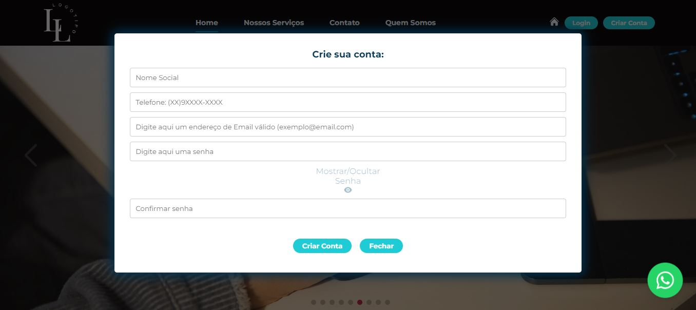  

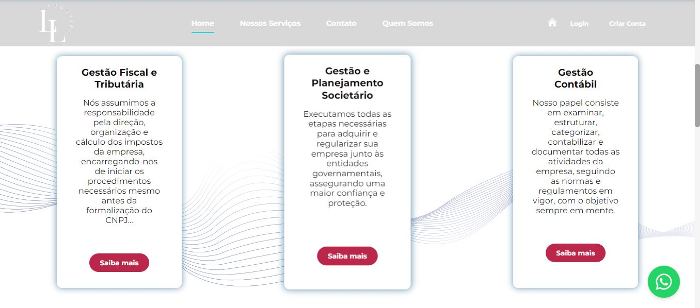  

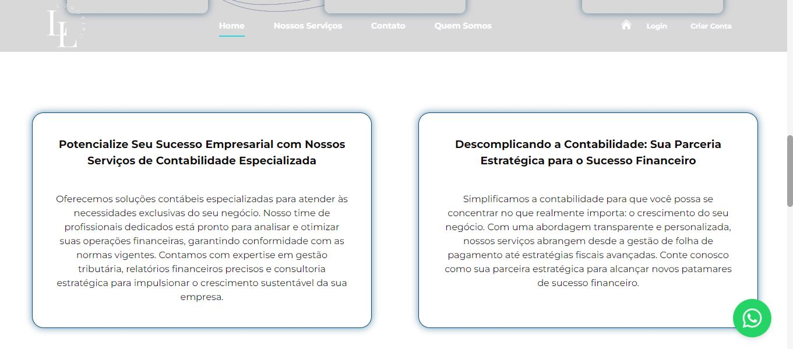  

  

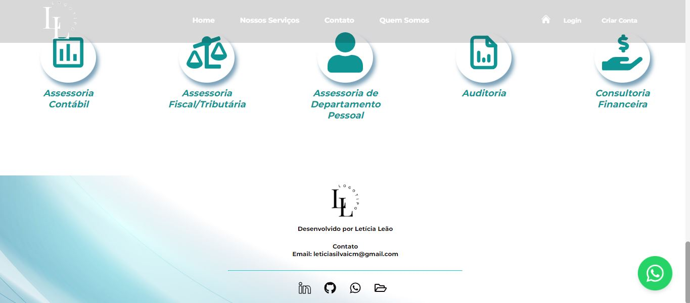  

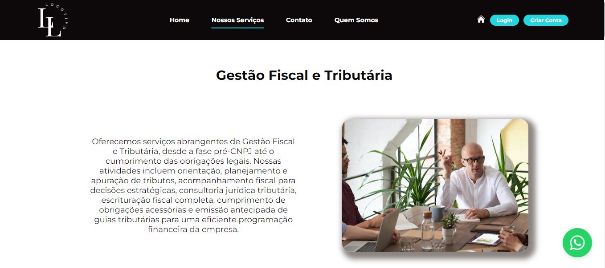  

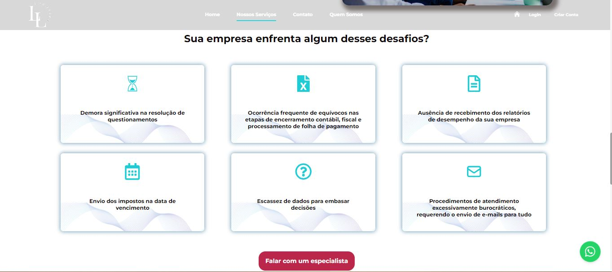  

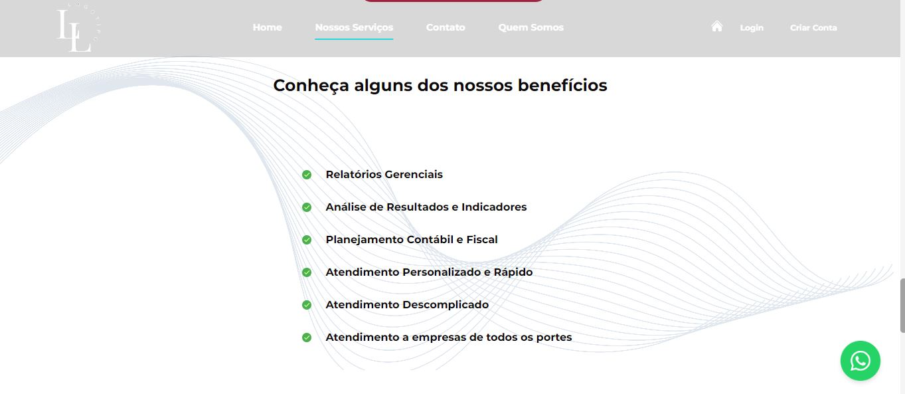  

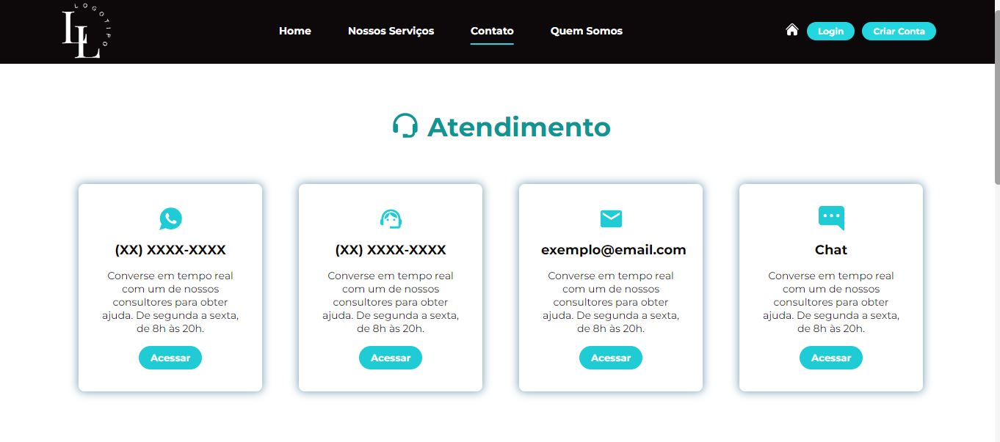  

  

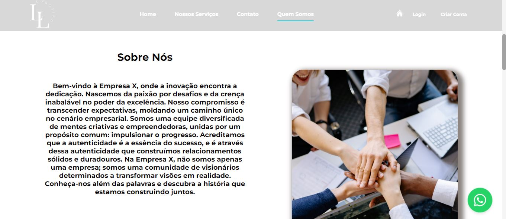  

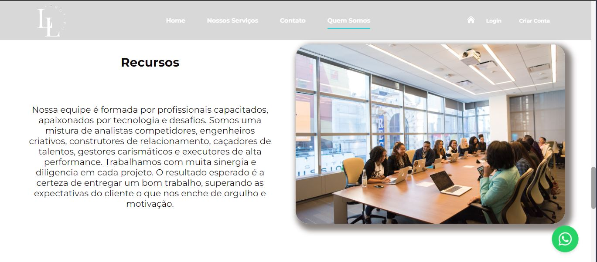  

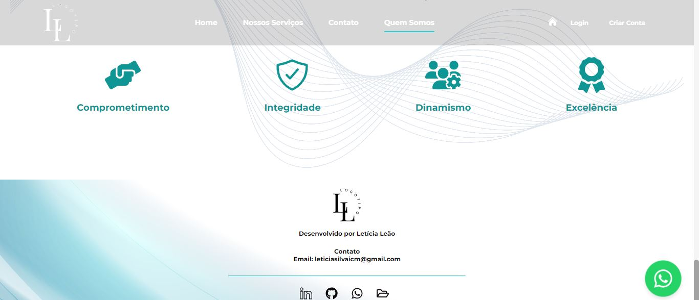  

